# Suzieq
Suzieq is an application focused on observability for IP networks: We want you to understand 
your network as a system. Suzieq gathers data and then allows analysis of the data in interesting ways.

Suzieq does multiple things. It collects data from different devices and systems. 
It normalizes the data and then stores it in a vendor independent way. Then it allows analysis of that data.
Suzieq has a pretty novel way of describing how to collect the data via various tools. We want to be
as agnostic as possible so that we can easily get all the necessary data in one place.

What does Suzieq do that is different from just logging into a device and getting the data?
1. It collects data from all devices and puts it in a central place.
2. It collects multiple data from each device.
3. It collects data from multiple vendors and normalizes to a standard set of data.
4. It collects data over time.

By using each of these dimensions, we can easily build interesting applications that help understand
networks in way that is much easier. We've just gotten started; our applications are only a brief
demonstration of what this approach can bring about. This is a very early release. We have many more ideas 
on what Suzieq can do, but we wanted to get this out
so that people can start using it. And start solving problems in their networks.

With the applications that we build on top of the framework we want to demonstrate a different
and more systematic approach to thinking about networks. We want to show how useful it is to think
of your network holistically. 

Suzieq data is focused on [Pandas DataFrames](https://pandas.pydata.org/pandas-docs/stable/getting_started/dsintro.html)
Everything returned by the analysis engine is a dataframe, which allows us to have a really nice abstraction
to build applications on.

For now, all the analysis are in a CLI. 

We are just getting started with Suzieq. We believe that this is a great platform for observing and understanding your
network. And we've written applications to demonstrate what is possible. Let us know your ideas on how to make things 
better.

# Analysis
Let's jump into what you can do with Suzieq now.
```
python3 suzieq/cli/suzieq-cli
```
There is a command prompt and at the bottom of the screen are some indicators of what Suzieq is up to:

The words in the bottom show specific choices that you can make to filter data.

A important concept in Suzieq is the *namespace*. we were originally thinking
of namespace as datacenter, but it can be whatever grouping of devices that you want. At this point
Suzieq cannot build a hierarchy of namespaces. We will add some way to group namespaces together in 
the future.

To get started, it's often a good idea to look at the help. Just type a '?' to get started:
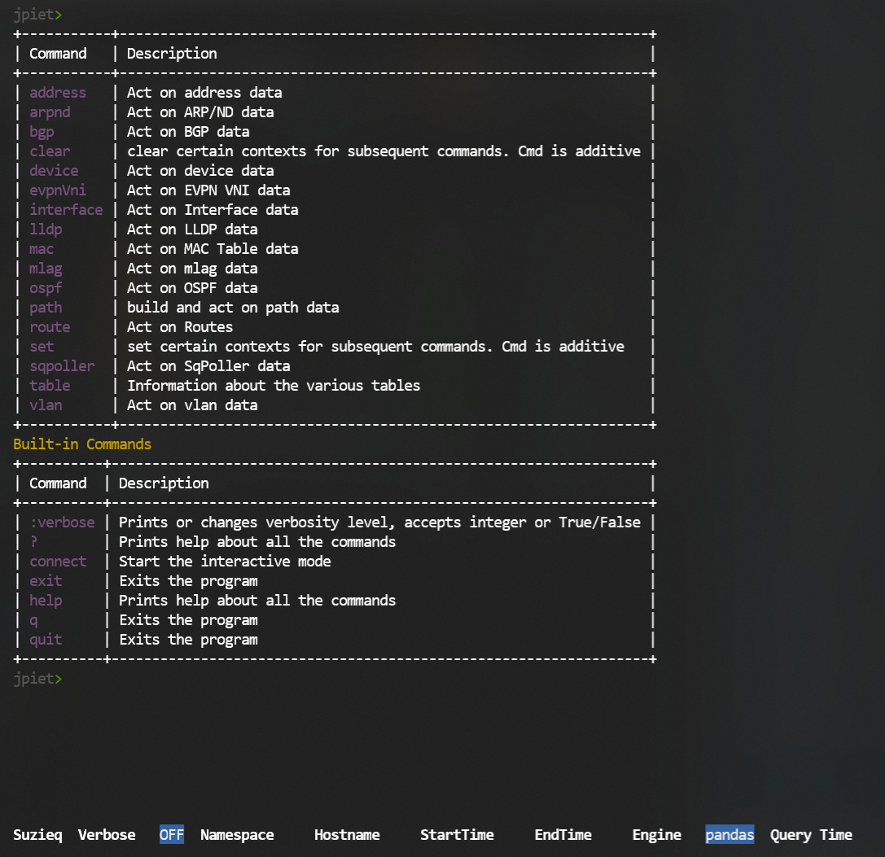
You see the commands that you can use with Suzieq. For each command there are a small number of verbs 
and some filters that you can add. Most commands have at least the 'show','summary', and 'unique' verbs; some 
commands have more.

Let's look at the some data. We'll start with the system data to get an overview of the devices
that we have data for. This shows that we have data from 14 devices and some information about each of
system. In this case, we have a single namespace, and it has some Cumulus Linux Routers and some Ubuntu hosts.
```
device show
```
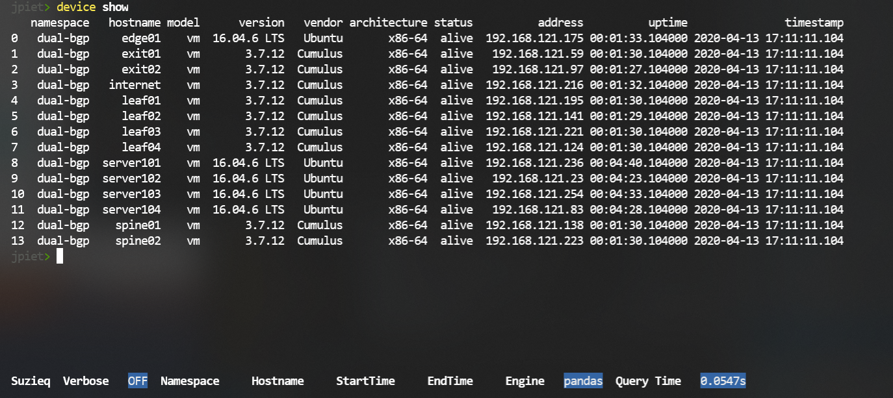

Another example of the same command, with Arista EOS devices. This is also a single namespace, with routers
and hosts.
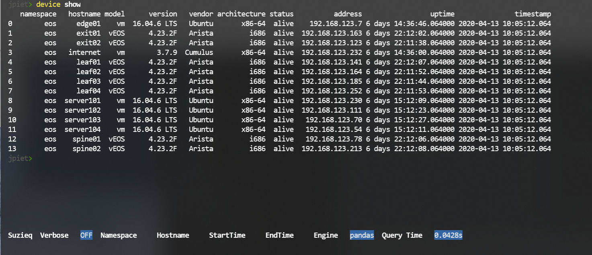

Each command has completion to help you understand what you can do with the command. 
For instance, interface command shows that it has five verbs that you can use with it.


## BGP Analysis Demo

Let's look at BGP data. We'll use this to demonstrate some of the things you can do with Suzieq.

We'll start with 'bgp show'. You can see that Suzieq shows a row per connection of a device and it's peer. 
This command includes data such as the current state of the connection, asn, peer asn, and important statistics
such as the number of prefixes received, how long the connection has been established, and the number of
changes in the connection state. 
```
bgp show
```


There's a lot of data there. One way to break out data for most commands is to use the unique verb. 
Unique shows the unique items for a column, and a count of each. In this example, we just want to 
look at the ASNs. Let's look at what the ASNs are and
how many there are of each. The unique command requires that you use a columns= filter to pick 
which of the columns in the data you want to examine.
```
bgp unique columns=asn
```

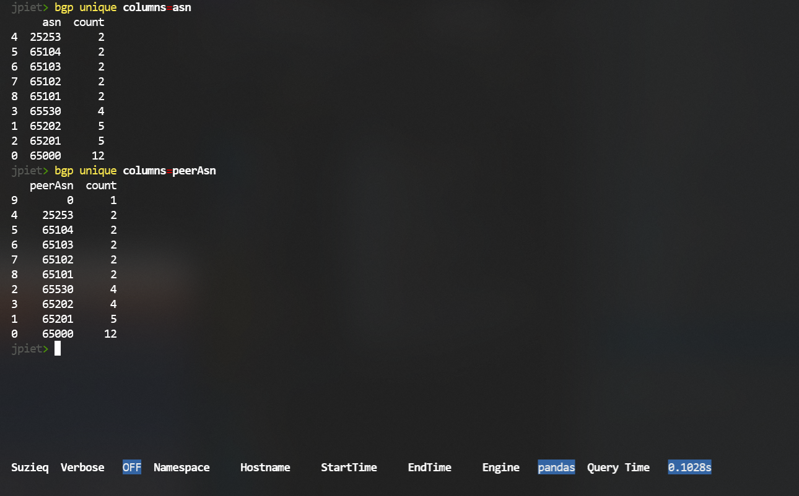

To get an overview of what is going on in a service, Suzieq has the verb summarize.
To get an overview of BGP in your networks, Suzieq has the command 'bgp summarize.'
```
bgp summarize
```
 
This can be a bit intimidating, as Suzieq is summarizing a lot of information.
As you can see, there is a column per namespace, though in this example we only have one namespace. 
We list the number of
ASNs, peerAsns, etc. It shows the number of rows, which are the number of rows in the 
table if you had just done a 'bgp show'. For items that have a count of 3 or less,
it shows the entries, and how many there are of each. In this example network,
there are two VRFs, with default having 32 rows and internet-vrf having 4. If an item has has 
more than 3 that you'd 
like to examine, you can use the unique verb as mentioned above. For instance, from summarize
 there are 9 ASNs. Using unique, as show above, you can see each ASN and how many times it is being used.

Another interesting concept is shown in v4PfxRx, V4PfxRx, etc, which is if you see three numbers
in a list, then Suzieq is showing you min, max, and median. This is our best
way to help you understand the distribution that you have.

Asserts are a very important part of Suzieq and we have some interesting ones defined, 
but a lot more to add in the future. This shows our bgp assert. This runs several different
checks on the bgp data and shows which ones failed.
```
bgp assert
```

You might notice that there is a row entry per device and peer. There is then a lot of information
that is needed to run the checks in the assert. Finally, at the end there is an assert column with
pass or fail for each row, and if there is a fail, there is a list of reasons that the row failed. At the
very end is a message if the Assert passed or Assert failed. 


## Path Demo
One of the nice things that we can do with Suzieq is show all the different paths
between two endpoints.
```
path show src='172.16.1.101' dest='172.16.4.104' namespace=dual-bgp
``` 
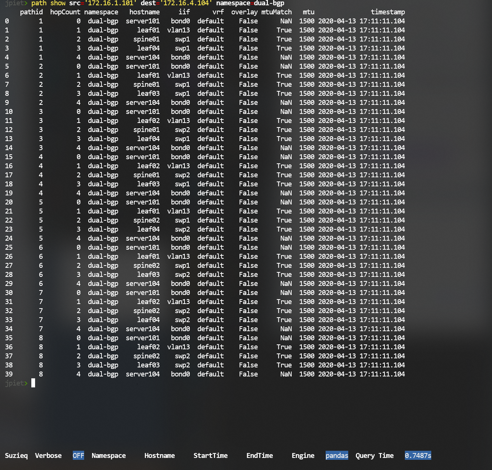 This is a little tricky 
to understand. In this example, there are eight different paths, represented
by their pathid. For each pathid, we then show each hop. As you can see,
we also show the mtu and if it is an overlay.

Path does not yet work in all cases, but it works in most that we know of. Some EVPN cases do not work yet;
underlays + overlays are tricky.

One quirk of the libraries that Suzieq uses is that IP addresses
must be put in quotes or they won't work.

You can also get a summary of the path between two IP addresses:

```
path summarize src='172.16.1.101' dest='172.16.4.104' namespace=dual-bgp
```
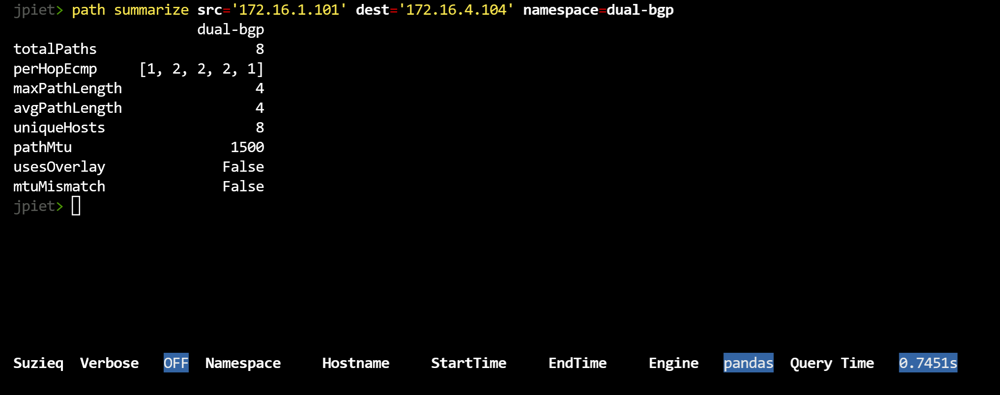

## Route Demo

A quick peak at routes, shows that there are 239 routes throughout the network.


We'd like to see the number of routes per device. That and other things can be understood
from the summarize command. We can see that there are only 39 unique routes in the network.
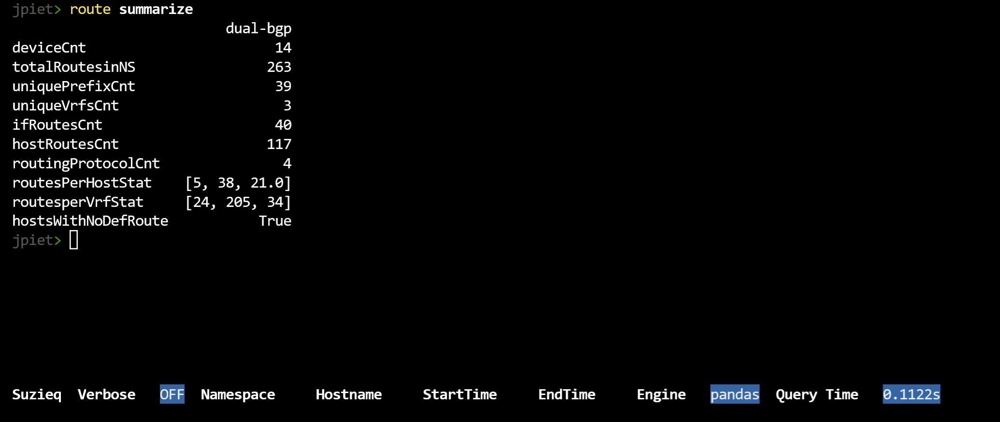

## LPM Demo
Another nice attribute of Suzieq is that you can do an LPM match and see the results from each device.
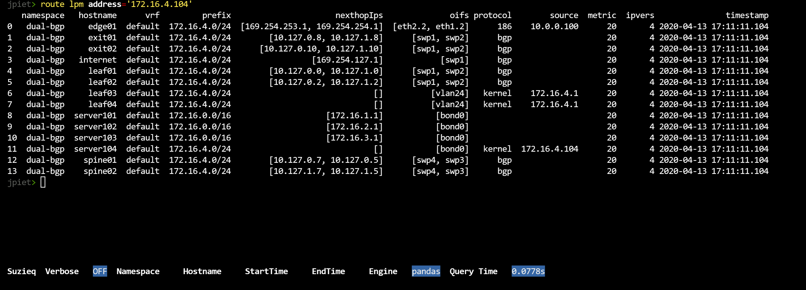

## Investigate Suzieq Tables

If you want to look at the database more directly, use the table command. There is not always
a single connection between tables in the database and commands that are available. Also, we are 
collecting data in some tables, such as ifCounters, that we do not yet have commands. 
We assume it's better to start getting data and then we can add useful analysis as we go along.

```
table show
``` 
shows each table in the database and some statistics about each one. 
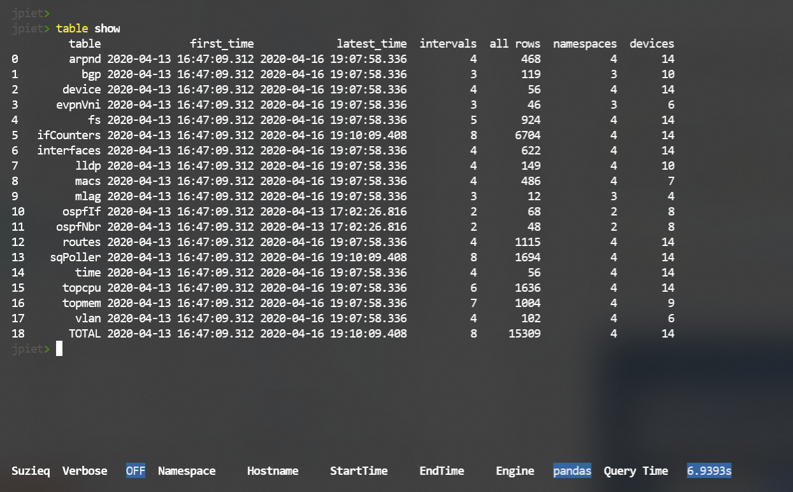
Suzieq only saves data to the database if there have been changes to the data. So some 
tables will iterate often, and some will not.

A special table is called sqPoller, and we do have access to that through the CLI. 
It records the work that Suzieq poller is doing. At this point it's probably only 
useful for developers.

For each table, you can look at what is in the data and what are the columns that are displayed automatically.
For instance, with BGP we collect a lot more data than we show by default. 


You can always display more columns by adding the columns filter at the end of a show command.
You can use 'columns=*' to get all the columns available for a command, but for bgp that is a lot!

## Using Suzieq on the command line
You can directly call a Suzieq command such as
```
bgp summarize
```
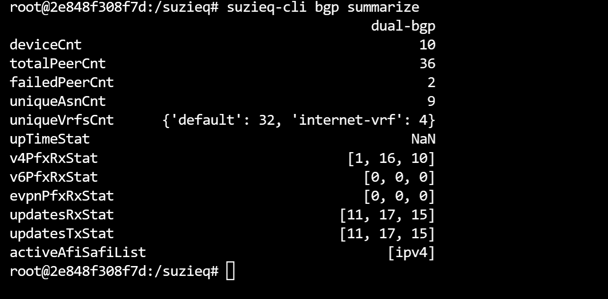

You can also check the output of the command. Based on the command you run, 
Suzieq will exit with interesting results. For instance, if you
run an assert and it fails, you will get an exit code other than 0 (usually 255.)
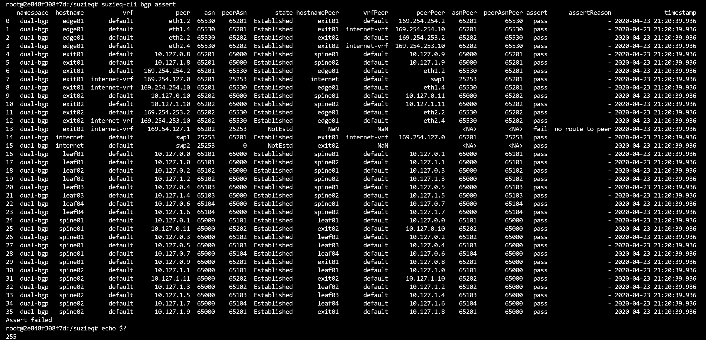


## Filtering
As shown above, the Suzieq cli works by commands (also called services), verbs, and filters. 
Some of the filters we've seen so far are columns and namespace. Different commands and verbs
have different filters. 

The standard filters that work on most command/verb paris are:
* hostname
* start-time
* end-time
* view
* namespace
* format
* columns


Most of those are self-explanatory. The default for view is latest, 
which means the most current change. view=all will provide
the data across all time. view=changes analyzes just the data
that has changed.

format= allows you to produce data other than in a pandas dataframe.
This is most useful at the command line to then read in the data 
from suzieq.


## Context Filtering
In the CLI you can set a specific context for filtering all the 
commands that you use. For instance, if you want to set a filter 
for the namespace that you will be investigating then you type
```
set namespace=dual-bgp
```
you can add or remove context filters as necessary.

## How time works in Suzieq
By default when you use the CLI and you use a command, you will be using 'view=latest'. This is usually
the most useful and what you expect to see. If you want to see all your data, add 'view=all'. You can also select 
specific start and end times that you are interested.

As Suzieq progresses, we expect to take more advantage of having data over time, including focusing on 
things that changed during a time interval

# Gathering Data
Two really important concepts in Suzieq are Nodes and Services. Nodes are devices of some kind;
they are the object being monitored. Services are the data that is collected and consumed by Suzieq. 
Service definitions describe how to get output from devices and then how to turn that into useful data.

Currently Suzieq supports polling [Cumulus Linux](https://cumulusnetworks.com/) or
 [Arista](https://www.arista.com/en/) devices, as well as Linux. 
Suzieq can easily support other device types, we just haven't had access to those and not time to 
chase them down.
Adding new device types starts by created a new [Service](docs/service-file-format.md).
Services do work work for what we have tested, but we have not tested around the edges of how
services are parsed. 
They might just work for you, but if you run into trouble we can only help a little right now. 

Suzieq started out with least common denominator SSH and REST access to devices. 
Suzieq does have support for agents to push data and we've done some experiments with them, but don't
have production versions of that code. 
# Running Suzieq

## Docker
the easiest way to use Suzieq is with a docker image.

* Download docker image. This same image can be used for the the poller
and the cli. When you attach to the container, it will give
you a bash prompt. 


### sq-poller
1. run a docker container for the poller. You need a an external directory
for the database and another directory for the config; that is what the -v
options are doing. 

1.  You will need to create a devices file. This contains the list of 
devices that you want to poll. The poller needs a [list of devices](docs/hosts-file-format.md) to poll. 
The easiest way to do this if you have 
ansible is to use the Suzieq genhosts utilitie to read an ansible
inventory and produce the right format:
    ```bash
    python3 suzieq/genhosts.py  ~/cloud-native-data-center-networking/topologies/dual-attach/.vagrant/provisioners/ansible/inventory/vagrant_ansible_inventory  ~/devices/dual-bgp dual-bgp
    ```
   The file looks like
   ```
   - namespace: dual-bgp
      hosts:
        - url: ssh://vagrant@192.168.121.51
        - url: ssh://vagrant@192.168.121.194
        - url: ssh://vagrant@192.168.121.104
        - url: ssh://vagrant@192.168.121.212
        - url: ssh://vagrant@192.168.121.225
        - url: ssh://vagrant@192.168.121.100
        - url: ssh://vagrant@192.168.121.50
        - url: ssh://vagrant@192.168.121.217
        - url: ssh://vagrant@192.168.121.136
        - url: ssh://vagrant@192.168.121.235
        - url: ssh://vagrant@192.168.121.253
        - url: ssh://vagrant@192.168.121.201
        - url: ssh://vagrant@192.168.121.121
        - url: ssh://vagrant@192.168.121.11
   ```

1.  run the poller container
    ```bash
    docker run -it -v /home/jpiet/parquet-out:/suzieq/parquet -v /home/jpiet/devices:/suzieq/devices --name sq-poller suzieq:0.1
    ```
     
    at the shell prompt 'sq-poller -D /suzieq/devices/dual-bgp '

### suzieq-cli
1.  run a docker container for the cli:
    ```bash
    docker run -it -v /home/jpiet/parquet-out:/suzieq/parquet --name suzieq-cli suzieq:0.1
    ```
  1.   at the shell prompt 'suzieq-cli'
## Installation with Pipenv
The complicated non-docker way to install Suzieq is to get the code from github
1. git clone: `git clone git@github.com:ddutt/suzieq.git`
2. Suzieq assumes the use of python3.7 which may not be installed on your computer by default. 
Ubuntu 18.04 ships with 3.6 as default, for example. Check your python version with python3 --version. 
If that is different from 3.7, you’ll need to add the python3.7 and 3.7 dev package. 
But, until we can build the different engines separately, we’re stuck with this requirement. 
3. To install python3.7 on Ubuntu18.04, please execute the following command
    ```
    sudo add-apt-repository ppa:deadsnakes/ppa
    sudo apt install python3.7 python3.7-dev
    ```
4. Install python3-pip if it has not been installed.
    ```
    sudo apt install python3-pip
    ``` 
1. From the suzieq directory, run pip3 on the requirements file
   ```bash
   pip3 install --user --disable-pip-version-check -r /requirements.txt
   ```

Suzieq requires that you have a suzieq config file either in '/.suzieq/suzieq-cfg.yml' or '/.suzieq-cfg.yml'.
It looks like:
```
data-directory: /home/jpiet/parquet-out
service-directory: /home/jpiet/suzieq/config
schema-directory: /home/jpiet/suzieq/config/schema
temp-directory: /tmp/suzieq
logging-level: WARNING
```

`python3 suzieq/poller/sq-poller.py -D ~/dual-bgp`

# Database and Data Persistence
Because everything in Suzieq revolves around dataframes, it can support different persistence engines underneath. 
For right now, we only support our own, which is built on [Parquet](https://parquet.apache.org/) files. 
This is setup should be fast enough
to get things going and for most people. It is also self contained and fairly simple. 
We have tried other storage systems, so we know it can work, but none
of that code is production worthy. As we all gain experience we can figure out what the right persistence engines are

One of the advantages is that the data are just files that can easily be passed around. There is no database code
that must be running before you query the data. 


# How to develop with Suzieq

# Faq
TBD

# Asserts
As demonstrated above in the README, Suzieq has a powerful concept called Asserts. In an assert for a service
some number of checks are made to ensure that the network is setup correctly. For each service that has an assert
you get an output that shows all the data necessary for the checks, a pass/fail column and 
a reason column for any failed checks.

Also, as mentioned before, if you run an assert from your 
shell and check the return code, a failure of the assert will
be a non-zero value, usually 255.

## BGP Assert
As shown above in the README


The checks that are run in the BGP assert are:
* outgoing link down
* no route to peer
* asn mismatch
* not established --  it gets the error that the device reported 
in the notifcnReason

## EvpnVni Assert
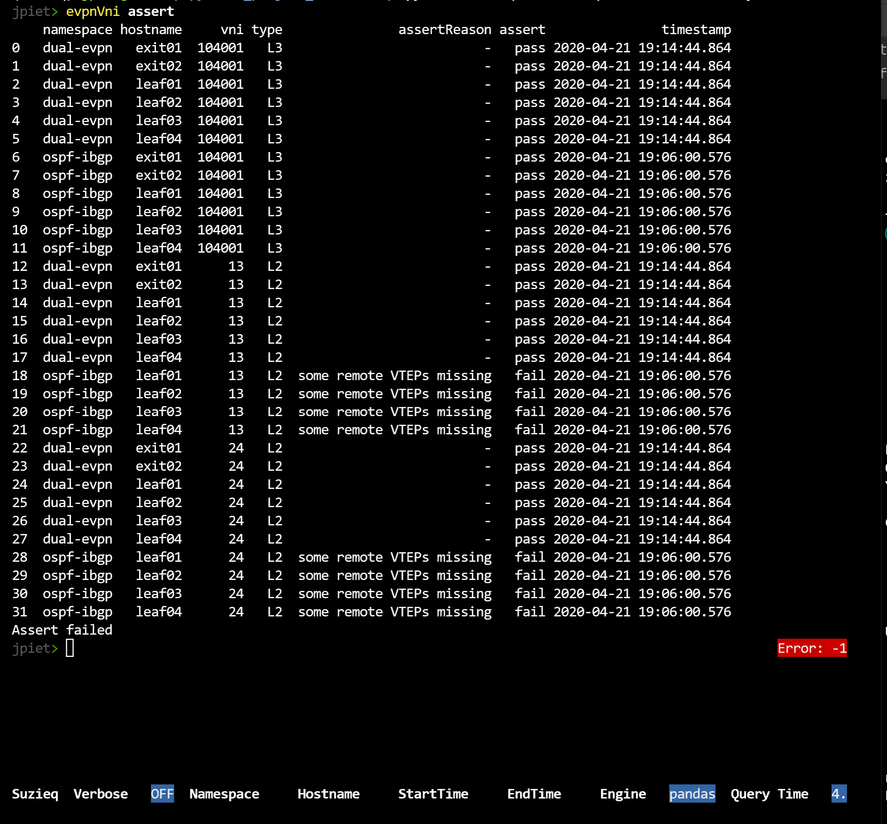

The checks in EvpnVni Assert are:
* interface is down
* some remote VTEPs missing
* a VTEP is not reachable
* a VTEP is reachable via default
* HER is missing VTEPs

## Interface Assert
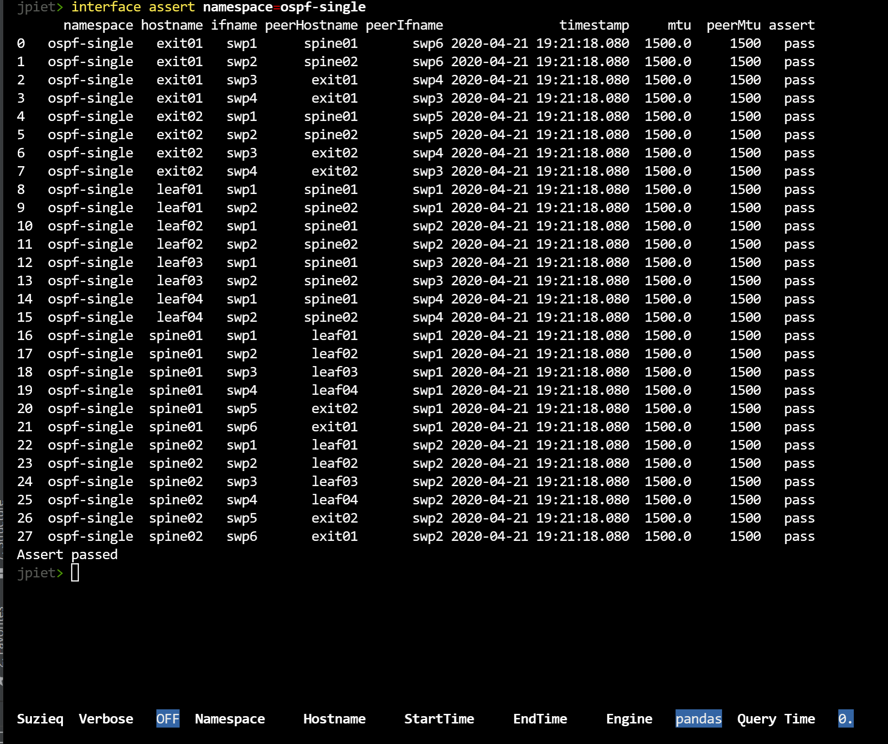

The checks in Interface Assert are:
* mtu match on both sides of a connection

## OSPF Assert
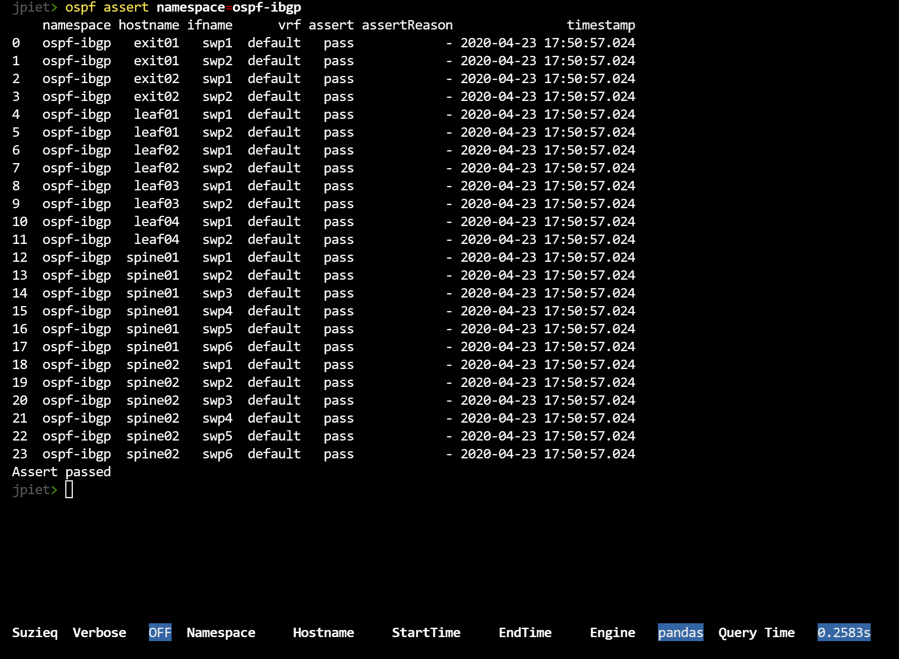

The cheks in OSPF Assert are:
* duplicate routerId 
* subnet mismatch
* area mismatch
* Hello timers mismatch
* Dead timer mismatch
* network type mismatch
* passive config mismatch
* vrf mismatch

# Summarize
## TODO


